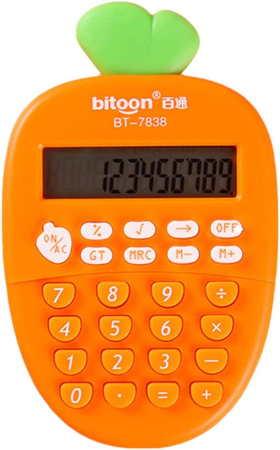
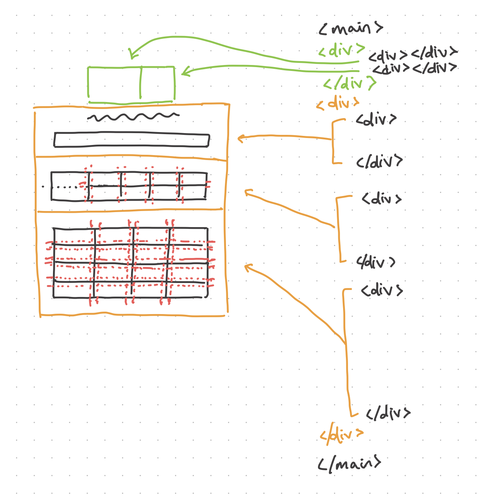

# Calculator Project

A project to implement a calculator using HTML, CSS, and JavaScript.

The calculator that I will be replicating looks like this:

<figure>
    
    <figcaption>Image sourced from Amazon.com</figcaption>
</figure>

## Planning

In thinking about how to recreate this design, I first decided to sketch up a basic layout of what I would need to write in HTML.

<figure>
    
    <figcaption> A draft of my HTML layout.</figcaption>
</figure>

Having a sketch of the calculator's layout was helpful in giving me a general idea of how to break down the different parts and sections.

## HTML & CSS

When writing the HTML for this calculator, I followed the sketch I drew up. I grouped similar visual elements with class names. For this project, I decided to mainly use non-semantic tags over semantic tags because there wasn't a need to to have meaningful elements, especially when creating visuals using CSS. The main semantic tag I used was the button tag for the actual calculator buttons.

For the stylesheet, I used SCSS to take advantage of using partials and modules, as well as the BEM naming convention to create different modifiers.

I utilised the border-radius property to create the shape of the carrot, which I believe produced the best result. Within the carrot, I created three divs to separate the different sections of the calculator which each had their own layout.

Inside these sections I used display:flex and display:grid to recreate the layout of a calculator. In doing this, I had to often adjust my HTML to get the result I wanted. An example of this is in the bottom section which consists of the numbered buttons. When I sketched out the layout, I initially thought a grid container of twelve divs would be the best solution, and perhaps it would have been the simplest solution, from a practical standpoint. However, I really wanted to replicate the cascading effect of the buttons, so I made the necessary adjustments to create it.

## JavaScript

I broke down the various tasks within a calculator to abstract the challenge and make it more manageable to solve:

### Coding Logic

-   ON/AC changes display to 0 and/or resets any stored values.
-   Off button turns off operation (i.e., numbers should not be displayed upon click)
-   Numbers output to the screen through EventListeners
    -   Numbers should concatenate to the current display
-   Operators work
-   Equals button executes math equation
    -   Can handle decimals (only can have one decimal point)
-   Display cannot exceed 10 characters

### Reflection

Some challenges I faced were:

-   Concatenating number presses to the display
    -   I had to make use of the browser console to make sure I was selecting the correct element.
-   Adding numbers resulted in concatenation
    -   I addressed this by converting the displayed numbers to the number type, and made sure to return back as a string
-   Numbers could still be inputted when display is "off"
    -   I was having a lot of trouble finding the correct expression to stop this from happening, but I eventually resolved this through creating a falsy condition.

### Additional functions to add

-   Complex calculations using memory functions (optional)
    -   Storing result in a memory variable
    -   Adding (or subtracting) current value to (or from) the memory value (M+/M-)
    -   Display the value stored in memory (MRC)
    -   Pressing MRC twice will clear memory (need a counter)
-   GT button to store the grand total of previous calculations
-   When equals is clicked twice, increment the value by the previous operand
